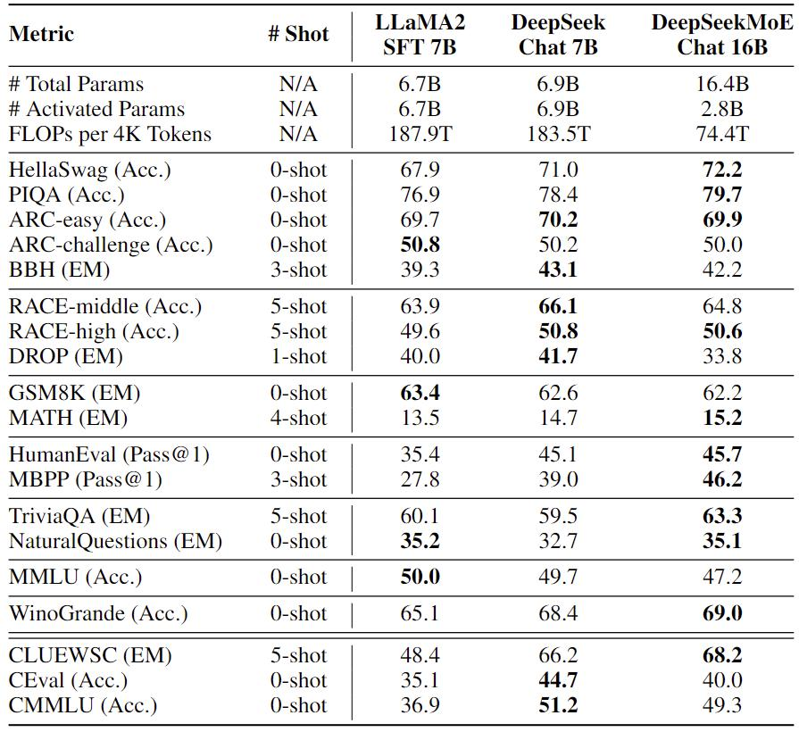

<!-- markdownlint-disable first-line-h1 -->
<!-- markdownlint-disable html -->
<!-- markdownlint-disable no-duplicate-header -->

<div align="center">
  
</div>
<hr>
<div align="center">

  <a href="https://www.deepseek.com/" target="_blank">
    
  </a>
  <a href="https://chat.deepseek.com/" target="_blank">
    
  </a>
  <a href="https://huggingface.co/deepseek-ai" target="_blank">
    
  </a>

</div>

<div align="center">

  <a href="https://discord.gg/Tc7c45Zzu5" target="_blank">
    
  </a>
  <a href="images/qr.jpeg" target="_blank">
    
  </a>
  <a href="https://twitter.com/deepseek_ai" target="_blank">
    
  </a>

</div>

<div align="center">

  <a href="LICENSE-CODE">
    
  </a>
  <a href="LICENSE-MODEL">
    
  </a>
</div>


<p align="center">
  <a href="#3-model-downloads">Model Download</a> |
  <a href="#2-evaluation-results">Evaluation Results</a> |
  <a href="#4-quick-start">Quick Start</a> |
  <a href="#5-license">License</a> |
  <a href="#6-citation">Citation</a>
</p>

<p align="center">
  <a href="https://arxiv.org/pdf/2401.06066.pdf"><b>Paper Link</b>👁️</a>
</p>


## 1. Introduction

DeepSeekMoE 16B is a Mixture-of-Experts (MoE) language model with 16.4B parameters. 
It employs an innovative MoE architecture, which involves two principal strategies: fine-grained expert segmentation and shared experts isolation. 
It is trained from scratch on 2T English and Chinese tokens, and exhibits comparable performance with DeekSeek 7B and LLaMA2 7B, with only about 40% of computations. 
For research purposes, we release the model checkpoints of DeepSeekMoE 16B Base and DeepSeekMoE 16B Chat to the public, which can be deployed on a single GPU with 40GB of memory without the need for quantization.
The model code file can be found [here](https://huggingface.co/deepseek-ai/deepseek-moe-16b-base/blob/main/modeling_deepseek.py).

## 2. Evaluation Results

### DeepSeekMoE 16B Base

We evaluate DeepSeekMoE 16B on various benchmarks and compare it with a series of models, as shown in the following.

- Comparison with open source models on the Open LLM Leaderboard. DeepSeekMoE 16B consistently outperforms models with a similar number of activated parameters by a large margin, and achieves comparable performance with LLaMA2 7B, which has approximately 2.5 times the activated parameters.

<p align="center">

</p>

- Comparison with DeepSeek 7B on our internal benchmarks. DeepSeek 7B is a dense model trained on the same corpus as DeepSeekMoE 16B. With only 40.5% of computations, DeepSeekMoE 16B achieves comparable performance with DeepSeek 7B. 

<p align="center">

</p>

- Comparison with LLaMA2 7B on our internal benchmarks. With only 39.6% of computations, DeepSeekMoE 16B outperforms LLaMA2 7B on the majority of benchmarks. 

<p align="center">

</p>

### DeepSeekMoE 16B Chat

We also evaluate DeepSeekMoE 16B Chat on various benchmarks and compare it with DeepSeek 7B Chat and LLaMA2 7B SFT. All of the compared models follow the same fine-tuning setting and data for fair comparison. 
The evaluation results are shown in the following. With only about 40% of computations, DeepSeekMoE 16B Chat achieves comparable or better performance than DeepSeek 7B Chat and LLaMA2 7B SFT. 

<p align="center">

</p>

## 3. Model Downloads

We release the DeepSeekMoE 16B, including both base and chat models, to the public. To support a broader and more diverse range of research within both academic and commercial communities. Please **note** that the use of this model is subject to the terms outlined in [License section](#5-license). Commercial usage is permitted under these terms.

### Huggingface

|         Model         | Sequence Length |                                Download                                 |
|:---------------------:|:---------------:|:-----------------------------------------------------------------------:|
| DeepSeekMoE 16B Base  |      4096       | 🤗 [HuggingFace](https://huggingface.co/deepseek-ai/deepseek-moe-16b-base)  |
| DeepSeekMoE 16B Chat  |      4096       | 🤗 [HuggingFace](https://huggingface.co/deepseek-ai/deepseek-moe-16b-chat)  |

## 4. Quick Start
### Installation

On the basis of `Python >= 3.8` environment, install the necessary dependencies by running the following command:

```shell
pip install -r requirements.txt
```

### Inference with Huggingface's Transformers

You can directly employ [Huggingface's Transformers](https://github.com/huggingface/transformers) for model inference.

**Text Completion**

```python
import torch
from transformers import AutoTokenizer, AutoModelForCausalLM, GenerationConfig

model_name = "deepseek-ai/deepseek-ai/deepseek-moe-16b-base"
tokenizer = AutoTokenizer.from_pretrained(model_name)
model = AutoModelForCausalLM.from_pretrained(model_name, torch_dtype=torch.bfloat16, device_map="auto")
model.generation_config = GenerationConfig.from_pretrained(model_name)
model.generation_config.pad_token_id = model.generation_config.eos_token_id

text = "An attention function can be described as mapping a query and a set of key-value pairs to an output, where the query, keys, values, and output are all vectors. The output is"
inputs = tokenizer(text, return_tensors="pt")
outputs = model.generate(**inputs.to(model.device), max_new_tokens=100)

result = tokenizer.decode(outputs[0], skip_special_tokens=True)
print(result)
```

**Chat Completion**

```python
import torch
from transformers import AutoTokenizer, AutoModelForCausalLM, GenerationConfig

model_name = "deepseek-ai/deepseek-moe-16b-chat"
tokenizer = AutoTokenizer.from_pretrained(model_name)
model = AutoModelForCausalLM.from_pretrained(model_name, torch_dtype=torch.bfloat16, device_map="auto")
model.generation_config = GenerationConfig.from_pretrained(model_name)
model.generation_config.pad_token_id = model.generation_config.eos_token_id

messages = [
    {"role": "user", "content": "Who are you?"}
]
input_tensor = tokenizer.apply_chat_template(messages, add_generation_prompt=True, return_tensors="pt")
outputs = model.generate(input_tensor.to(model.device), max_new_tokens=100)

result = tokenizer.decode(outputs[0][input_tensor.shape[1]:], skip_special_tokens=True)
print(result)
```

Avoiding the use of the provided function `apply_chat_template`, you can also interact with our model following the sample template. Note that `messages` should be replaced by your input.

```
User: {messages[0]['content']}

Assistant: {messages[1]['content']}<｜end▁of▁sentence｜>User: {messages[2]['content']}

Assistant:
```

**Note:** By default (`add_special_tokens=True`), our tokenizer automatically adds a `bos_token` (`<｜begin▁of▁sentence｜>`) before the input text. Additionally, since the system prompt is not compatible with this version of our models, we DO NOT RECOMMEND including the system prompt in your input.

### How to Fine-tune DeepSeekMoE

We provide script `fintune/finetune.py` for users to finetune our models on downstream tasks.

The script supports the training with [DeepSpeed](https://github.com/microsoft/DeepSpeed). You need install required packages by:

```bash
pip install -r requirements.txt
```

Please follow [Sample Dataset Format](https://huggingface.co/datasets/garage-bAInd/Open-Platypus) to prepare your training data.
Each item has two required fields `instruction` and `output`.

After data preparation, you can use the sample shell script to finetune the DeepSeekMoE model. 
Remember to specify `DATA_PATH`, `OUTPUT_PATH`.
And please choose appropriate hyper-parameters(e.g., `learning_rate`, `per_device_train_batch_size`) according to your scenario.
We have used flash_attention2 by default. For devices supported by flash_attention, you can refer [here](https://github.com/Dao-AILab/flash-attention).
For this configuration, zero_stage needs to be set to 3, and we run it on eight A100 40 GPUs.

```bash
DATA_PATH="<your_data_path>"
OUTPUT_PATH="<your_output_path>"
MODEL_PATH="<your_model_path>"

cd finetune
deepspeed finetune.py \
    --model_name_or_path $MODEL_PATH \
    --data_path $DATA_PATH \
    --output_dir $OUTPUT_PATH \
    --num_train_epochs 3 \
    --model_max_length 1024 \
    --per_device_train_batch_size 16 \
    --per_device_eval_batch_size 1 \
    --gradient_accumulation_steps 4 \
    --evaluation_strategy "no" \
    --save_strategy "steps" \
    --save_steps 100 \
    --save_total_limit 100 \
    --learning_rate 2e-5 \
    --warmup_steps 10 \
    --logging_steps 1 \
    --lr_scheduler_type "cosine" \
    --gradient_checkpointing True \
    --report_to "tensorboard" \
    --deepspeed configs/ds_config_zero3.json \
    --bf16 True \
    --use_lora False
```

You can also finetune the model with 4/8-bits qlora, feel free to try it. For this configuration, it is possible to run on a single A100 80G GPU, and adjustments can be made according to your resources.
```bash
DATA_PATH="<your_data_path>"
OUTPUT_PATH="<your_output_path>"
MODEL_PATH="<your_model_path>"

cd finetune
deepspeed finetune.py \
    --model_name_or_path $MODEL_PATH \
    --data_path $DATA_PATH \
    --output_dir $OUTPUT_PATH \
    --num_train_epochs 3 \
    --model_max_length 1024 \
    --per_device_train_batch_size 16 \
    --per_device_eval_batch_size 1 \
    --gradient_accumulation_steps 4 \
    --evaluation_strategy "no" \
    --save_strategy "steps" \
    --save_steps 100 \
    --save_total_limit 100 \
    --learning_rate 2e-5 \
    --warmup_steps 10 \
    --logging_steps 1 \
    --lr_scheduler_type "cosine" \
    --gradient_checkpointing True \
    --report_to "tensorboard" \
    --deepspeed configs/ds_config_zero2_no_offload.json \
    --bf16 True \
    --use_lora True \
    --bits 4 \
    --max_grad_norm 0.3 \
    --double_quant \
    --lora_r 64 \
    --lora_alpha 16 \
    --quant_type nf4 \
```

## 5. License
This code repository is licensed under the MIT License. The use of DeepSeekMoE models is subject to the Model License. DeepSeekMoE supports commercial use.

See the [LICENSE-CODE](LICENSE-CODE) and [LICENSE-MODEL](LICENSE-MODEL) for more details.

## 6. Citation

```
@article{dai2024deepseekmoe,
  author={Damai Dai and Chengqi Deng and Chenggang Zhao and R. X. Xu and Huazuo Gao and Deli Chen and Jiashi Li and Wangding Zeng and Xingkai Yu and Y. Wu and Zhenda Xie and Y. K. Li and Panpan Huang and Fuli Luo and Chong Ruan and Zhifang Sui and Wenfeng Liang},
  title={DeepSeekMoE: Towards Ultimate Expert Specialization in Mixture-of-Experts Language Models}, 
  journal   = {CoRR},
  volume    = {abs/2401.06066},
  year      = {2024},
  url       = {https://arxiv.org/abs/2401.06066},
}
```


## 7. Contact

If you have any questions, please raise an issue or contact us at [service@deepseek.com](mailto:service@deepseek.com).
